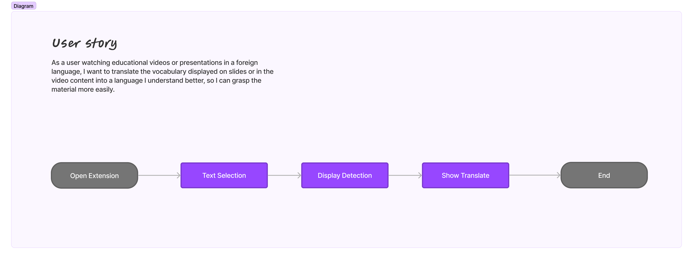

# Trans Frame - System Analysis

## Target

This Chrome extension enables translation by capturing images on web pages.

## How it works?

## Flow Explain

### [F1] Text Selection

1. 利用 `chrome.scripting.executeScript` 實現框選網頁中的範圍，並取得位置參數 `position`
2. 利用 `chrome.tabs.captureVisibleTab` 擷取當前畫面，並根據 `position` 進行裁切
3. 獲得網頁擷取部分

### [F2] Display Detection

1. 利用 API 將圖片傳送至後端 Server
2. 利用深度學習模型偵測圖片中出現之文字
3. 將偵測結果回傳至前端
4. 顯示於前端畫面

### [F3] Show Translate

1. 發送 API 將偵測到的文字傳至後端
2. 透過 Google translate API 對文字進行翻譯
3. 回傳翻譯結果
4. 顯示於前端畫面
